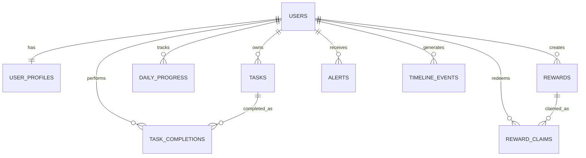
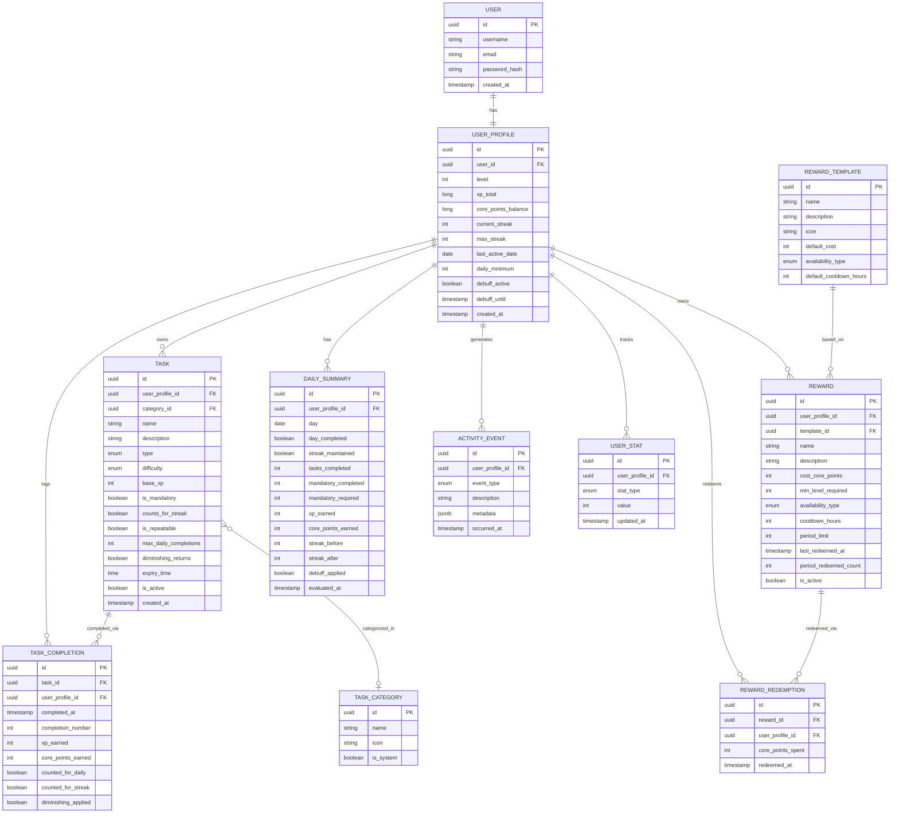

# 🧠 Database Design — Grind Protocol

This document defines the MVP database design for the Grind Protocol application.

---

## 📊 ER Diagram (MVP)

---

## 🧱 Core Entities

### USERS
Represents the base identity of a user.

- id (PK)
- username (unique)
- email (unique)
- timezone
- active
- created_at
- updated_at

---

### USER_PROFILES
Represents the game state of the user.

- id (PK)
- user_id (FK, unique)
- display_name
- daily_task_goal
- total_xp
- core_points
- current_streak
- best_streak
- last_evaluated_date
- created_at
- updated_at

---

### TASKS
Defines user tasks.

- id (PK)
- user_id (FK)
- title
- description
- category
- difficulty
- task_type
- mandatory
- streak_eligible
- repeatable
- max_completions_per_day
- diminishing_returns_enabled
- active
- due_time
- weekly_closing_day
- created_at
- updated_at

---

### TASK_COMPLETIONS
Represents each task execution.

- id (PK)
- task_id (FK)
- user_id (FK)
- completed_at
- completion_date
- completion_index_for_day
- counted_for_daily_goal
- counted_for_streak
- base_xp
- awarded_xp
- awarded_core_points
- notes
- created_at

---

### DAILY_PROGRESS
Stores daily evaluation results.

- id (PK)
- user_id (FK)
- progress_date
- required_task_count
- completed_valid_task_count
- mandatory_tasks_required
- mandatory_tasks_completed
- day_qualified
- evaluated_at
- created_at

---

### REWARDS
Defines rewards.

- id (PK)
- user_id (FK, nullable)
- template_based
- title
- description
- cost_core_points
- required_level
- availability_type
- cooldown_days
- max_claims_per_period
- period_type
- active
- created_at
- updated_at

---

### REWARD_CLAIMS
Represents reward redemption.

- id (PK)
- reward_id (FK)
- user_id (FK)
- claimed_at
- cost_paid
- notes
- created_at

---

### ALERTS
Stores system alerts.

- id (PK)
- user_id (FK)
- alert_type
- severity
- title
- message
- related_entity_type
- related_entity_id
- triggered_at
- read_at
- dismissed_at
- active
- created_at

---

### TIMELINE_EVENTS
Stores historical events.

- id (PK)
- user_id (FK)
- event_type
- title
- description
- source_type
- source_id
- metadata_json
- created_at

---

## 🔗 Relationships

- Users → 1:1 → User Profiles
- Users → 1:N → Tasks
- Users → 1:N → Task Completions
- Users → 1:N → Daily Progress
- Users → 1:N → Reward Claims
- Users → 1:N → Alerts
- Users → 1:N → Timeline Events
- Tasks → 1:N → Task Completions
- Rewards → 1:N → Reward Claims

---

## 🧠 Design Decisions

- Separation between `users` and `user_profiles`
- `task_completions` is the source of truth
- `daily_progress` simplifies streaks and analytics
- `rewards.user_id` nullable for template system
- Alerts and timeline are persisted for traceability

---

## ⚙️ Enums (Application Layer)

- TaskCategory
- TaskDifficulty
- TaskType
- AvailabilityType
- PeriodType
- AlertType
- AlertSeverity
- TimelineEventType

---

## 📌 Constraints

- user_profiles.user_id UNIQUE
- daily_progress UNIQUE (user_id, progress_date)
- task_completions indexed by (user_id, completion_date)
- rewards.cost_core_points >= 0
- user_profiles.total_xp >= 0
- user_profiles.core_points >= 0

---

## 🚀 Future Extensions

- streaks
- debuffs
- stats tracking
- social features

---

This document represents the MVP database design and will evolve with the system.

---
## 🗄️ Database Schema 2
